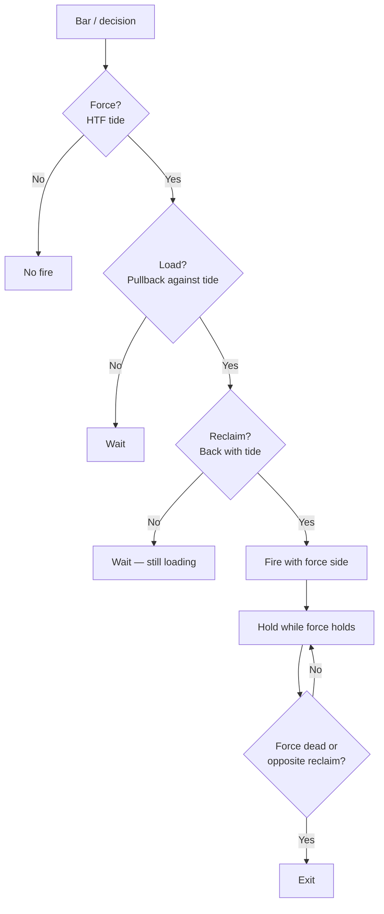
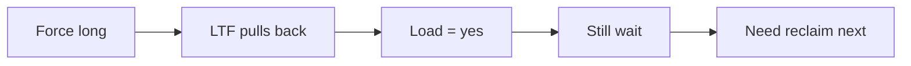
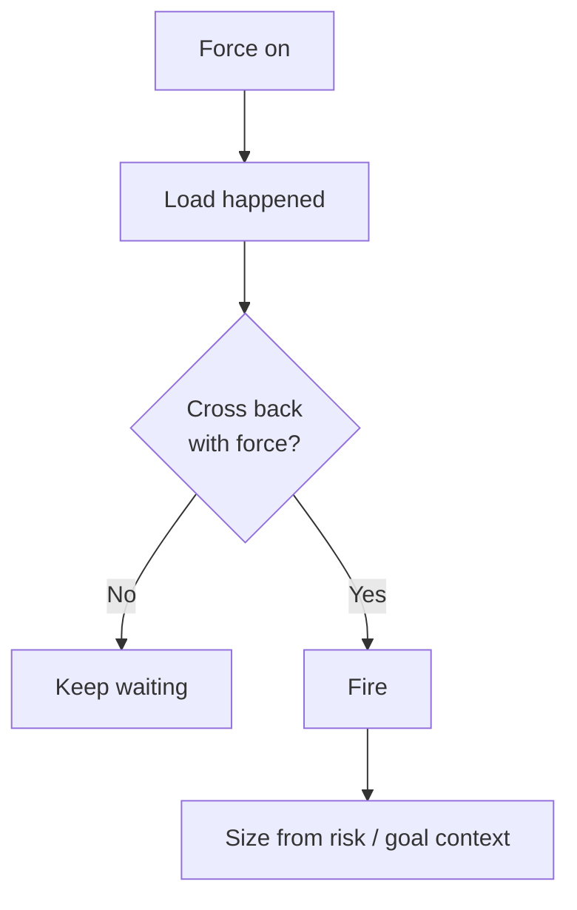
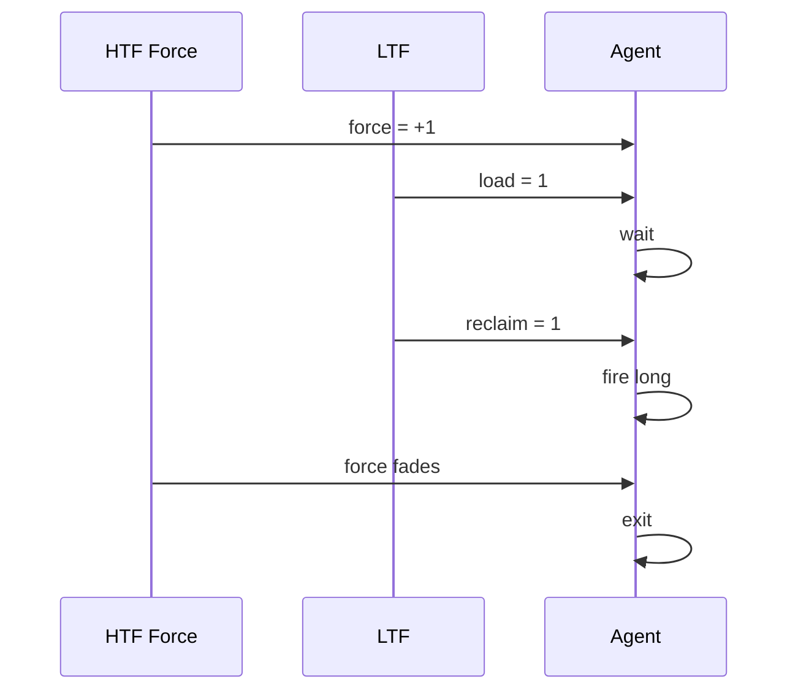
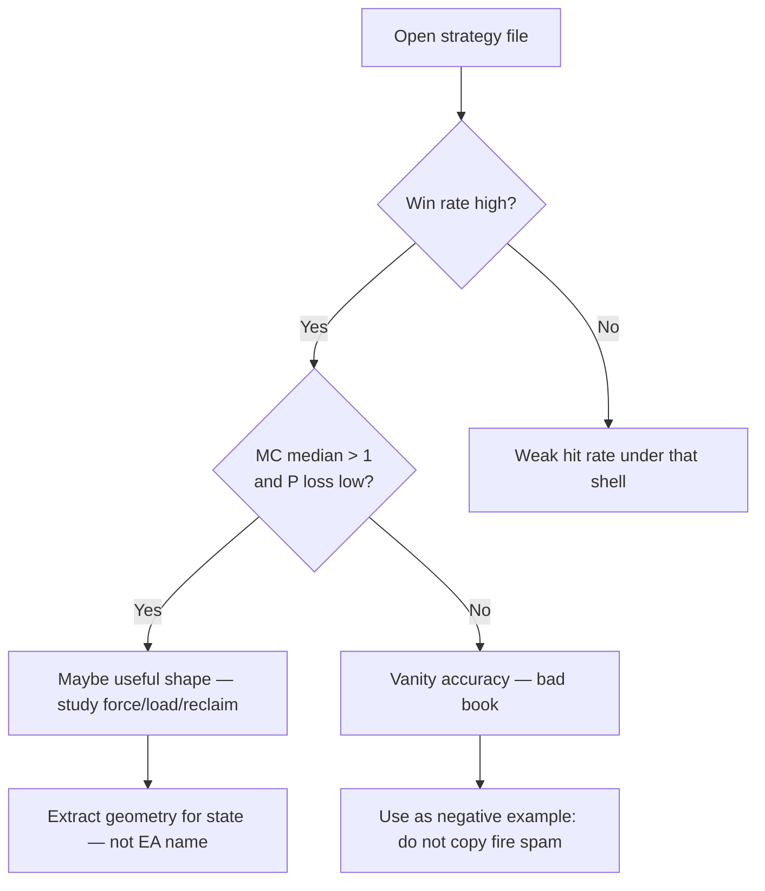
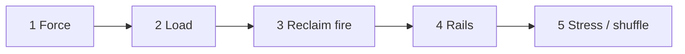

# 0000 — RL Learning strategy

**Who this is for:** any LLM with **no prior knowledge** — words are plain on purpose.  
**What this is:** how we teach the model to **think** about trades.  
**What this is not:** a finished bot, Court law, or a list of EA names to copy.  
**Next file:** [0001_RL_From_Zero_State_Action_Reward.md](0001_RL_From_Zero_State_Action_Reward.md) (state, action, reward, full loop).

We do **not** teach: “RSI below 30 → buy.”  
We teach a **pattern** the model can reuse on any pair, any target, any set.

---

## 1. The only thinking pattern

Three steps. Always in this order.

| Step | Plain meaning | Model’s job |
|------|----------------|-------------|
| **Force** | Is there a real tide on the higher times? | Know the side — or know there is no side |
| **Load** | Did price pull back / coil against that tide? | Wait. Do not chase the dip |
| **Reclaim** | Did price come back with the tide? | That is when firing is allowed |

**Hard rule:** higher time = side. Lower time = when. Lower time never flips the side.

---

## 2. Big picture flowchart

```text
                    START (each bar / each decision)
                              |
                              v
                    +------------------+
                    |  Is there FORCE? |
                    |  (HTF tide)      |
                    +--------+---------+
                             |
              +--------------+--------------+
              | no                          | yes
              v                             v
     +----------------+            +----------------+
     | NO FIRE        |            | Is there LOAD? |
     | (or tiny size) |            | (pullback)     |
     +----------------+            +--------+-------+
                                            |
                             +--------------+--------------+
                             | no                          | yes
                             v                             v
                    +----------------+            +----------------+
                    | WAIT           |            | Did RECLAIM    |
                    | (hold / flat)  |            | happen?        |
                    +----------------+            +--------+-------+
                                                           |
                                            +--------------+--------------+
                                            | no                          | yes
                                            v                             v
                                   +----------------+            +----------------+
                                   | WAIT           |            | FIRE with      |
                                   | still loading  |            | force side     |
                                   +----------------+            +--------+-------+
                                                                              |
                                                                              v
                                                                     manage / exit
                                                                     when force dies
                                                                     or reverse reclaim
```

### Same flow (mermaid)



---

## 3. Force — teach this first

**Question:** Is the higher-time picture pointed one way?

```text
        HTF1                    HTF2
     (e.g. 30m)              (e.g. 1h)
          |                       |
          +-----------+-----------+
                      |
                      v
              Both agree up?  --> FORCE = LONG
              Both agree down? --> FORCE = SHORT
              Disagree / flat? --> FORCE = NONE
```

**Examples of “agree” (sensors — not the law):**

- price above mid on both HTFs → long force  
- price below mid on both → short force  
- momentum line M &gt; 0 on both (and strong enough) → long force  
- same with M &lt; 0 → short force  

**Fail (bad lesson):**

```text
HTF1 up, HTF2 down  -->  model still fires  -->  WRONG
LTF flips while HTF flat --> model treats LTF as side  -->  WRONG
```

**What to put in state:**

- `force_sign`: -1 / 0 / +1  
- `force_strength`: 0 to 1  

**Train order:** only learn force until the model is good at “side or no side.”

---

## 4. Load — teach this second

**Question:** Under a real tide, did the lower time go the other way for a bit?

```text
FORCE = LONG
        |
        v
   LTF dips / stretches down
   (eddy, band touch, M below 0, etc.)
        |
        v
   LOAD = YES
   side is STILL long
   do NOT short
   do NOT buy the low yet
```



**Fail (bad lesson):**

```text
Load starts  -->  model buys immediately at the bottom
              -->  that is dip-chase, not reclaim
```

**What to put in state:**

- `load_flag`  
- `load_depth` (how stretched)  
- `bars_since_load`  

**Train order:** only count load as valid when force ≠ 0 and load is **against** force.

---

## 5. Reclaim — teach this third (the fire)

**Question:** Did the lower time come back through the line **with** the tide?

```text
FORCE = LONG
LOAD  = was yes (eddy below)
        |
        v
   LTF crosses back up
   (M back through 0, RSI back through band, retest holds, etc.)
        |
        v
   RECLAIM = YES  -->  FIRE LONG allowed
```



**Fail (bad lesson):**

```text
First touch of extreme  -->  fire without cross back
Force = none            -->  fire on any LTF cross
Force long              -->  fire short on upper band  (anti-tide fade as default)
```

**What to put in state:**

- `reclaim_flag` (or one-bar pulse)  
- `bars_since_reclaim`  

**Train order:** reward fires that sit on reclaim under force; punish dip-chase and no-force spam.

---

## 6. Full good path vs bad paths

### Good long path

```text
t0  FORCE turns +1
t1  LOAD turns on     (wait)
t2  still load        (wait)
t3  RECLAIM           --> fire long
t4  hold while force holds
t5  force dies / opposite reclaim --> exit
```



### Bad path A — dip chase

```text
force +1 --> load on --> FIRE at bottom (no reclaim) --> BAD
```

### Bad path B — no tide thrash

```text
force 0 --> LTF crosses both ways --> many trades --> BAD
```

### Bad path C — fight the tide

```text
force +1 strong --> short every pop up --> may win small often --> still wrong shape
```

---

## 7. How the model should use scores (from strategy files)

We tested many strategies. The files have three kinds of numbers.  
**Do not mix them up.**

```text
+------------------+     +------------------+     +------------------+
| ACCURACY / WR    |     | RETURN on path   |     | MONTE CARLO      |
| How often TP hit |     | One history path |     | Many random paths|
+--------+---------+     +--------+---------+     +--------+---------+
         |                        |                        |
         v                        v                        v
   Easy to fake              One lucky order          Lie detector
   with tight TP             of wins/losses           for the trade bag
```

| Number | Means | Teach the model |
|--------|--------|-----------------|
| **Win rate** | How often a trade won under that exit setup | Not the goal by itself |
| **Trades** | How many samples | Too few → ignore the pretty WR |
| **MC median** | Half of random paths end above this (start = 1) | &gt; 1 is healthier than &lt; 1 |
| **P(loss)** | Share of paths that end under water | High WR + high P(loss) = false win |



**Rule for learning:**

> Win rate = how often the small target won.  
> Monte Carlo = whether the bag of trades still works when order changes.  
> Geometry = what the world should look like when we allow fire.

---

## 8. What goes into the brain (state pack)

Keep it simple. Roles, not brand names.

```text
force_sign, force_strength
load_flag, load_depth, bars_since_load
reclaim_flag, bars_since_reclaim
session_ok, structure_ok          optional rails
goal_target, risk_budget          context — same weights, different dials
```

```text
+-------------+     +-------------+     +-------------+
|  SENSORS    | --> |  SHAPES     | --> |  POLICY     |
|  RSI, M, BB |     |  F / L / R  |     |  fire/size  |
|  price, etc |     |  in state   |     |  or wait    |
+-------------+     +-------------+     +-------------+
```

Sensors feed shapes.  
Shapes train the policy.  
**Do not** hard-code “sensor name = action.”

---

## 9. Training order (curriculum)

```text
Stage 1     Stage 2      Stage 3       Stage 4        Stage 5
Force       + Load       + Reclaim     + rails        + stress
only        under        fire only     session /      shuffle /
            force        on reclaim    structure      hard paths
  |            |             |              |              |
  v            v             v              v              v
 side OK    wait OK      fire OK       less noise     not one
                                          on path       lucky path
```



**Do not start at Stage 3.**  
**Do not train only to max win rate** with tiny TP — that teaches barrier tricks, not thinking.

---

## 10. What we refuse to teach

| Refuse | Why |
|--------|-----|
| EA filename as the skill | Name ≠ edge |
| Rank #1 from a leaderboard | Same code often shared under many names |
| Max win rate only | Easy to fake |
| LTF as side | Breaks the stack |
| Fire on load bottom | Dip chase |
| Fire with no force | Thrash |

---

## 11. One page memory

```text
                    FORCE
                   /     \
                 no       yes
                 |         |
              no fire     LOAD?
                         /    \
                       no      yes
                       |        |
                     wait    RECLAIM?
                              /    \
                            no      yes
                            |        |
                          wait      FIRE
```

**Think in shapes. Score with honesty. Never let lower time rewrite the tide.**

---

## Where this sits

| Path | Role |
|------|------|
| `Learning-How_to/` | Our learning progress (this folder) |
| `0000_RL_Learning strategy.md` | This method (start here) |
| `strategies/` | Lab tests, scores, language — fuel, not the brain |
| `strategies/RL_SHAPES_AND_SCORE_CARD.md` | Longer examples if needed |

Next files in this folder will go deeper (`0001_…`) without changing this core.
