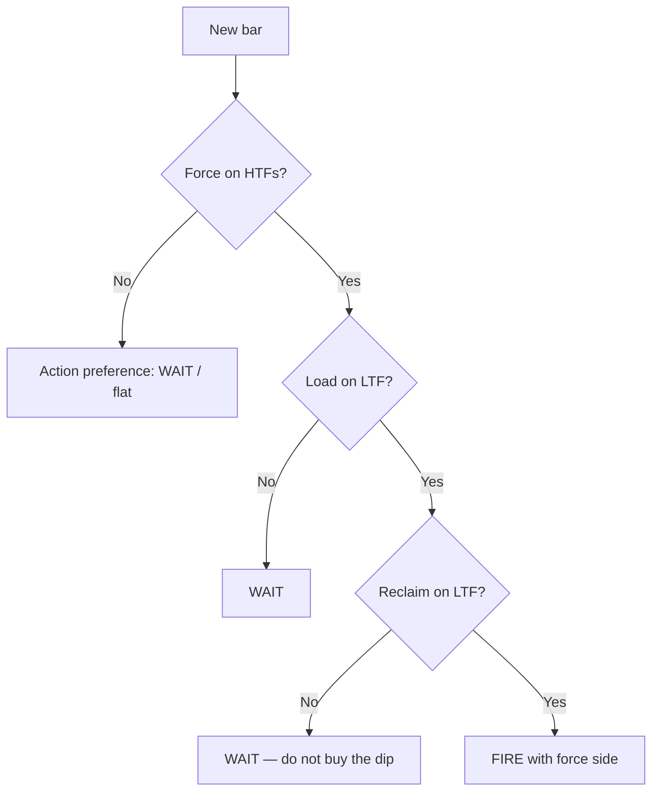
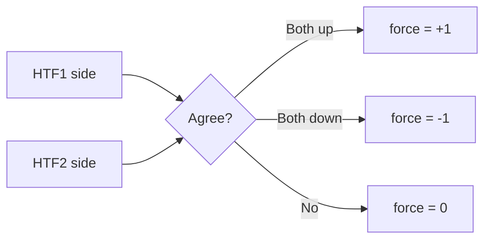
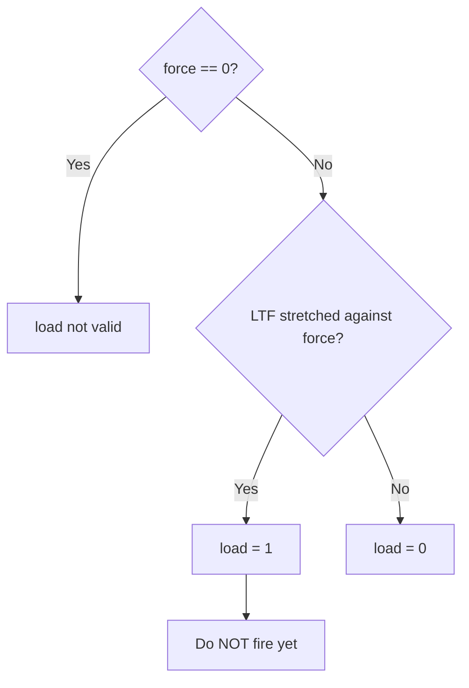
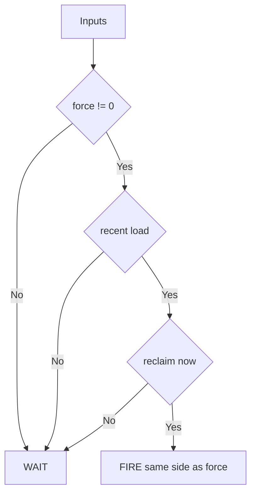
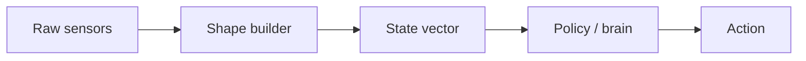
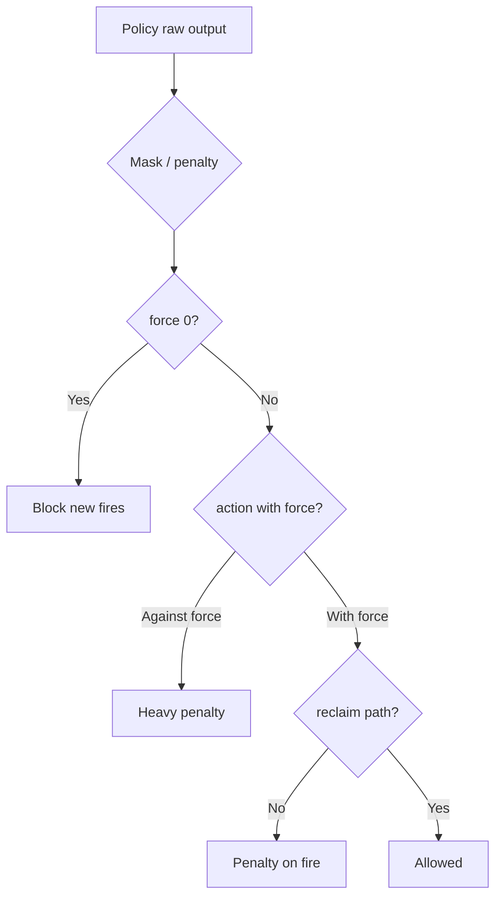
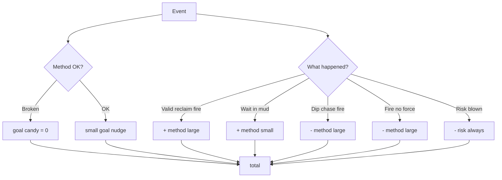
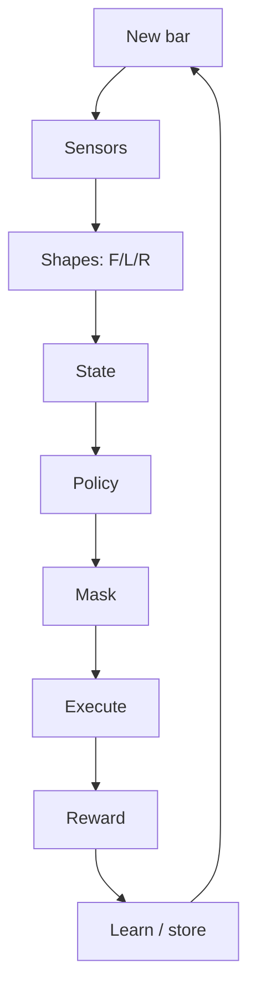
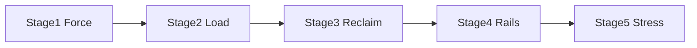

# 0001 — From zero: state, action, reward

**Who this is for:** any LLM (or person) that has **no idea** how this project teaches trading to an RL model.  
**Read after:** [0000_RL_Learning strategy.md](0000_RL_Learning%20strategy.md) (or start here — this file explains from scratch).  
**Not** a live bot. **Not** Court law. Teaching only.

If a word is new, it is defined the first time it appears.

---

## 0. What we are trying to do

We want a computer program that **looks at market data** and **chooses what to do**:

- stay flat (do nothing), or  
- go long (bet price will go up), or  
- go short (bet price will go down), or  
- change size / exit  

That program is trained with **reinforcement learning (RL)**.

### What “RL” means here (simple)

```text
+----------+       sees        +--------+
|  WORLD   | ----------------> | AGENT  |
| (prices) |                   | (brain)|
+----------+                   +---+----+
     ^                             |
     |         does an action      |
     +-----------------------------+
     |         then gets a score   |
     |         (reward: good/bad)  |
     +-----------------------------+
```

| Word | Meaning in this project |
|------|-------------------------|
| **World** | Price bars (open, high, low, close) on one or more timeframes |
| **Agent / brain / policy** | The model that picks actions |
| **State** | The numbers we feed the brain so it “sees” the world |
| **Action** | What the brain chooses (wait, long, short, exit, size…) |
| **Reward** | A score after the action: higher = “that was more like what we want” |
| **Episode** | One stretch of time (many bars) while the agent acts |

**Important:** we do **not** teach the brain a list of indicator names.  
We teach it a **way to think**: tide → pullback → rejoin tide.

---

## 1. What a “bar” is

A **bar** (or candle) is one row of price data for a fixed clock slice.

```text
Example: 5-minute bar
  open  = price at start of those 5 minutes
  high  = highest price in those 5 minutes
  low   = lowest price in those 5 minutes
  close = price at end of those 5 minutes
```

The agent usually decides **once per bar** (or on bar close), not on every tick, unless we say otherwise.

---

## 2. What a “timeframe” is

**Timeframe** = how big each bar is.

| Name you may see | Meaning |
|------------------|---------|
| 1m | each bar = 1 minute |
| 5m | each bar = 5 minutes |
| 15m, 30m, 1h, 4h, 1d | larger slices |

### Why we use more than one timeframe

- **Higher timeframe (HTF)** = slower picture. Good for “which way is the tide?”  
- **Lower timeframe (LTF)** = faster picture. Good for “is this a small dip or a real turn?”

```text
HTF (slow)     ~~~~~~~~~~~~~~~~~~~~~~~~>  tide / side
LTF (fast)     /\/\  /\/\  /\/\  /\/\>  timing only
```

**Hard rule (never break when teaching):**

> Higher time decides the **side**.  
> Lower time decides the **when**.  
> Lower time must **not** invent a new side.

In this lab we often use **two HTFs + one LTF** (example: 15m + 30m for side, 1m or 5m for timing). Exact sets can change; the **roles** stay the same.

---

## 3. The thinking pattern (three shapes)

We pack the world into three ideas. Teach them in order.

| Shape | Plain English | Allowed when missing? |
|-------|---------------|------------------------|
| **Force** | Is there a real tide on the higher times? | If no force → usually **no new trade** |
| **Load** | Did the fast chart pull back against that tide? | If no load → **wait** (do not force a trade) |
| **Reclaim** | Did the fast chart come back **with** the tide? | Only then is **fire** (enter) preferred |



### ASCII (same idea)

```text
BAR
 |
 v
FORCE? --no--> WAIT
 |
 yes
 v
LOAD? --no--> WAIT
 |
 yes
 v
RECLAIM? --no--> WAIT
 |
 yes
 v
FIRE (same side as force)
```

---

## 4. Force — detail for a beginner LLM

### 4.1 Definition

**Force** = higher-timeframe agreement that price has a direction.

- Force long → we only think about **long** setups  
- Force short → we only think about **short** setups  
- Force none → market is muddy; **do not thrash**

### 4.2 How you might *measure* force (examples, not holy rules)

Any of these can feed the **same** idea `force_sign`:

| Example measure | Long force if… | Short force if… |
|-----------------|----------------|-----------------|
| Price vs a middle line on **both** HTFs | both HTFs above mid | both below mid |
| A slow momentum line M on both HTFs | M &gt; 0 on both (and strong enough) | M &lt; 0 on both |
| Both HTFs with rising / falling structure | both rising | both falling |

**You do not need all sensors.** You need the **role**: dual HTF agreement = force.

### 4.3 Flowchart — force only

```text
        HTF1 side?          HTF2 side?
            |                   |
            +---------+---------+
                      |
                      v
              both long  --> force = +1
              both short --> force = -1
              else       --> force =  0
```



### 4.4 Wrong lessons about force

| Wrong | Why wrong |
|-------|-----------|
| LTF crossed up → force is long | LTF is timing, not tide |
| One HTF up, one down → still trade | No agreement = no force |
| Force was long yesterday → still long forever | Force must be checked each decision |

---

## 5. Load — detail for a beginner LLM

### 5.1 Definition

**Load** = under **existing force**, the LTF moves **against** that force for a while (pullback, coil, “eddy”).

- Force long + LTF dips → load for a **later long**  
- Force short + LTF pops up → load for a **later short**  

Load is **not** “flip side.” Side stays with force.

### 5.2 Picture

```text
Price (force long)

  high  ________
               \        <-- load (dip against tide)
                \____/
                     \____  <-- still waiting
                          \
                           *  <-- reclaim happens later (next section)
```

### 5.3 Flowchart — load only



### 5.4 Wrong lessons about load

| Wrong | Why wrong |
|-------|-----------|
| Price dipped → buy now | That is **dip chase**. Fire is on **reclaim**, not on load |
| Load while force = 0 | Random noise, not a real pullback in a tide |
| Load means reverse the trade | Load is tension **with** the tide plan |

---

## 6. Reclaim — detail for a beginner LLM

### 6.1 Definition

**Reclaim** = LTF **comes back through** a line (zero, band, level) **in the force direction** after a load.

That is the preferred **entry moment** (fire).

### 6.2 Example stories (long)

```text
1) Momentum line M on LTF went below 0 while HTF force long  → load
2) M crosses back above 0                                   → reclaim
3) Agent may go long                                        → fire
```

```text
1) Fast RSI went outside a lower band while force long      → load
2) RSI crosses back up into / through the band              → reclaim
3) Agent may go long                                        → fire
```

### 6.3 Flowchart — when fire is preferred

```text
force != 0
   AND load was true (recently)
   AND reclaim pulse true now
        --> preferred FIRE with force side
else
        --> preferred WAIT
```



### 6.4 Wrong lessons about reclaim

| Wrong | Why wrong |
|-------|-----------|
| Every cross is a fire | Need force + load story, not spam |
| Reclaim against force | Fighting the tide |
| Fire on first touch of extreme | No “come back” yet |

---

## 7. State — what we feed the brain

**State** = a list of numbers (and flags) that describe the world **right now**.

The brain does **not** read English. It reads the state vector.

### 7.1 Minimum state pack (start here)

| Name | Type | Meaning |
|------|------|---------|
| `force_sign` | -1, 0, +1 | Tide side |
| `force_strength` | 0…1 | How strong the tide looks |
| `load_flag` | 0/1 | Are we in pullback against force? |
| `load_depth` | 0…1 | How deep the pullback |
| `bars_since_load` | int | How long since load started |
| `reclaim_flag` | 0/1 | Did reclaim just happen? |
| `bars_since_reclaim` | int | Age of last reclaim |
| `position` | -1, 0, +1 | Flat / long / short now |
| `bars_in_trade` | int | How long we have been in |

### 7.2 Optional rails (later)

| Name | Meaning |
|------|---------|
| `session_ok` | Are we in the hours we care about? (e.g. London/NY) |
| `structure_ok` | Small structure filter (higher low / lower high texture) |
| `goal_target` | What profit target we want this run (context, not retrain) |
| `risk_budget` | How much risk is allowed this run |

```text
SENSORS (RSI, M, BB, price...)
        |
        v
   SHAPE BUILDER  -->  force / load / reclaim numbers
        |
        v
   STATE VECTOR  -->  BRAIN  -->  ACTION
```



**Rule:** sensors are ingredients. **Shapes** are what the brain should learn.  
Do not train “RSI=28 → buy” as the identity of the agent.

---

## 8. Actions — what the brain can do

Start with a **small** action set so learning is clear.

### 8.1 Simple discrete actions

| Action id | Meaning |
|-----------|---------|
| 0 | **WAIT** — no new entry; if flat, stay flat |
| 1 | **FIRE_LONG** — open / stay long (only smart if force +1 and reclaim story) |
| 2 | **FIRE_SHORT** — open / stay short |
| 3 | **EXIT** — go flat |

Later you can add size buckets (small / mid / full). First get wait vs fire right.

### 8.2 Action preference mask (training help)

Even if the brain *can* output any action, we can **mask** or **penalize** illegal ones:

```text
if force == 0:     prefer WAIT/EXIT, punish new FIRE
if force == +1:    punish FIRE_SHORT as main plan
if force == -1:    punish FIRE_LONG as main plan
if no reclaim:     punish FIRE_* 
if reclaim+force:  allow FIRE same side
```



This is how we teach **thinking**, not random thrash.

---

## 9. Reward — how we score the brain

**Reward** = a number after a step (or at trade end). The RL update makes high-reward behavior more likely.

### 9.1 What we want the reward to teach

| Want | So the agent learns… |
|------|----------------------|
| Wait when no force | Not to spam trades in mud |
| Wait through load | Not to dip-chase |
| Fire on reclaim with force | Correct entry shape |
| Exit when force dies | Not to hold a dead idea forever |
| Respect risk | Not to bet the farm for a tiny win rate |

### 9.2 What we do **not** want reward to teach

| Bad reward target | What goes wrong |
|-------------------|-----------------|
| Maximize **win rate only** | Agent loves tiny TP / weird exits that “win often” but lose money |
| Maximize **trade count** | Thrash; looks busy; dies in Monte Carlo |
| Copy **strategy rank #1 name** | Names share code; rank is not geometry |
| Reward any profit with no shape | Agent finds loopholes, not thinking |

### 9.3 Simple reward sketch (for teaching — tune later)

**Law: method first, goal second** (relative to rewards *and* penalties).

```text
total = method_reward  +  goal_reward  +  risk_penalty
         ^^^^^^^^^^^^     ^^^^^^^^^^^     ^^^^^^^^^^^^^
         DOMINANT         SECONDARY       always if blown
         (F/L/R shapes)   (PnL / progress)  (breach)
```

| If method this step is… | Goal candy (positive PnL / progress) |
|-------------------------|--------------------------------------|
| **OK** (wait mud, wait load, fire reclaim) | Small secondary nudge allowed |
| **Broken** (fire no force, dip-chase, anti-force) | **Zero** — no candy for bad shape |

Per bar or per trade end:

```text
method_reward =
  + small for WAIT when force==0
  + small for WAIT when load and not reclaim
  + larger for FIRE on valid reclaim (with force)
  - large for FIRE with force==0
  - large for FIRE against force
  - large for FIRE on load bottom without reclaim

goal_reward  = small * scaled_outcome   # only if method OK
risk_penalty = large if risk blown      # always
```

**Code:** `compose_method_goal_reward` in `evidence_court/meta_rl/path_learning.py`  
**Shapes:** `METHOD_FIRST_REWARD` / `shape_reward` in `Aaron_here/tools/top5_shape_observe.py`  
**Curriculum:** `aaron_reason_curriculum.py` (method process terms + compose)



### 9.4 Honest check outside the reward

Lab files also have **Monte Carlo** numbers:

- High win rate + high **P(loss)** under Monte Carlo → the “wins” were often a **story**, not a strong book  
- Use those strategies as **negative examples** (what not to copy), not as teachers of “max WR”

---

## 10. One full decision cycle (step by step)

Pretend you are the LLM building the agent loop:

```text
1. Read new LTF bar (and HTF values aligned to this time)
2. Compute sensors (M, bands, etc.)  — ingredients only
3. Compute force_sign, force_strength from HTFs
4. Compute load_* from LTF under that force
5. Compute reclaim_flag from LTF
6. Build state vector (+ position, goal, risk)
7. Policy outputs action (or action probabilities)
8. Apply mask/penalties for illegal shape
9. Execute action in simulator (or paper)
10. Compute reward
11. Store transition (state, action, reward, next_state) for learning
12. Repeat
```



---

## 11. Curriculum — teach in layers (do not skip)

| Stage | Teach only | Success looks like |
|-------|------------|--------------------|
| **1** | Force | Agent stays flat when force=0; side matches HTF when it fires at all |
| **2** | Load | Agent waits during pullback; does not reverse side |
| **3** | Reclaim fire | Entries cluster on reclaim, not on load bottoms |
| **4** | Rails | Fewer junk hours / junk structure fires |
| **5** | Stress | Still sane when trade order is shuffled / hard windows |

```text
[1 Force] --> [2 Load] --> [3 Reclaim] --> [4 Rails] --> [5 Stress]
    |            |              |              |              |
  side OK     patience       good fire      less noise    not one
                                                          lucky path
```



**If you jump to Stage 3 first**, the agent often learns thrash or dip-chase.

---

## 12. How this connects to the `strategies/` folder

You may see many strategy files and scores. For an LLM with no context:

| Thing in `strategies/` | What it is | How to use for RL |
|------------------------|------------|-------------------|
| Language / notes | Human description of an idea | Mine **shapes**, not names |
| Win rate after tweaks | Hit rate under a lab exit shell | Easy to fake; not the main teacher |
| Monte Carlo block | Random path test on trade results | Lie detector for weak books |
| Rank number | Sort order in a report | **Do not** treat as “best bot” |

```text
strategies/ reports
      |
      v
 extract: force/load/reclaim examples
      |
      v
 Learning-How_to method
      |
      v
 state + reward + curriculum
      |
      v
 train brain
```

---

## 13. Cheat sheet (print this in your head)

```text
SIDE     = force on two higher times (or force = none)
WAIT     = no force, or load without reclaim
FIRE     = force + recent load + reclaim, same side
NEVER    = LTF rewrites side, dip-chase, fire in mud
REWARD   = shape first, then PnL; never win-rate-only
STATE    = shapes + position + goal/risk context
```

```text
     FORCE
    /     \
  none     yes
   |        |
 WAIT     LOAD?
         /    \
       no      yes
       |        |
     WAIT    RECLAIM?
              /    \
            no      yes
            |        |
          WAIT      FIRE
```

---

## 14. What file to write next (roadmap)

| File | Goes deeper into |
|------|------------------|
| **0000** | Core thinking + score reading |
| **0001** (this) | State, action, reward, loop, curriculum from zero |
| **0002** (next) | Labeling bars from history; positive/negative windows |
| **0003** (later) | Exits, hold, and risk as shapes (not only entries) |
| **0004** (later) | Multi-set / multi-pair transfer (same brain, new context) |

---

**Bottom line for a blank LLM:**

1. Build **state** from force / load / reclaim (and position).  
2. Prefer **wait** unless reclaim lines up with force.  
3. **Reward** correct shape; punish thrash and dip-chase.  
4. **Train in stages.**  
5. Use strategy file **win rates** carefully; use **Monte Carlo** to avoid lies.  
6. Never let the fast chart become the tide.
